<div align="center">


**A full-stack customer relationship management platform for managing leads, customers, deals, and team collaboration.**

[](https://mini-saas-crm.vercel.app/)


</div>

---

## Overview

Mini SaaS CRM is a MERN-stack application that gives sales teams a single workspace to track leads, customers, deals, tasks, and customer interactions. It covers the complete account lifecycle, including email-verified registration, team invitations with role assignment, organization settings, and exportable sales reports.

The project demonstrates end-to-end SaaS fundamentals: token-based authentication, role-aware interfaces, RESTful API design, schema validation, transactional email, and cloud deployment.

## Screenshots

### Core CRM

| Dashboard | Leads |
|:---:|:---:|
| 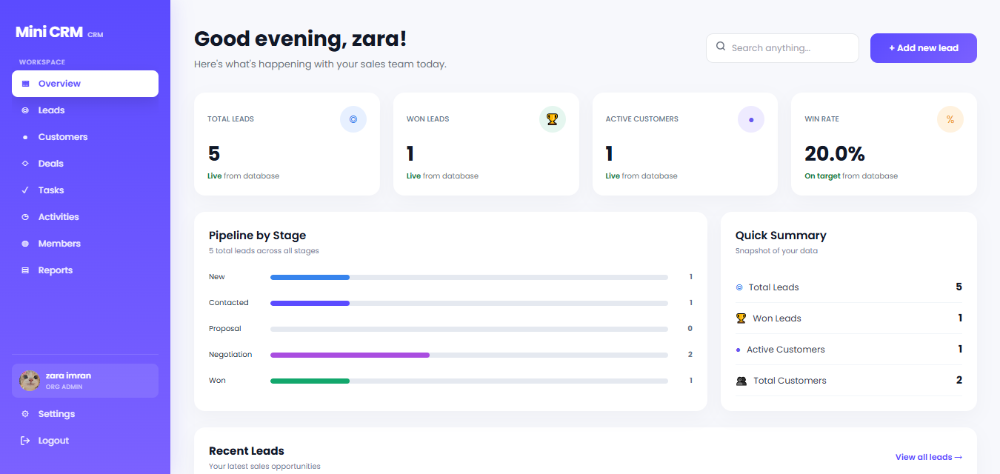 | 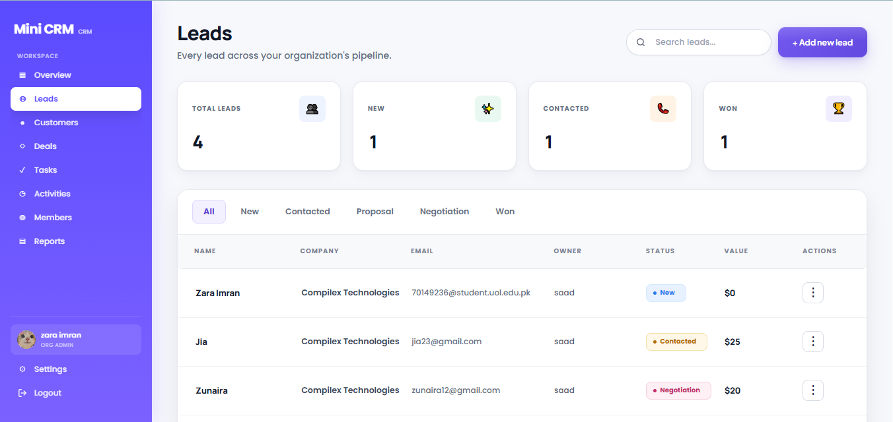 |
| **Customers** | **Deals** |
| 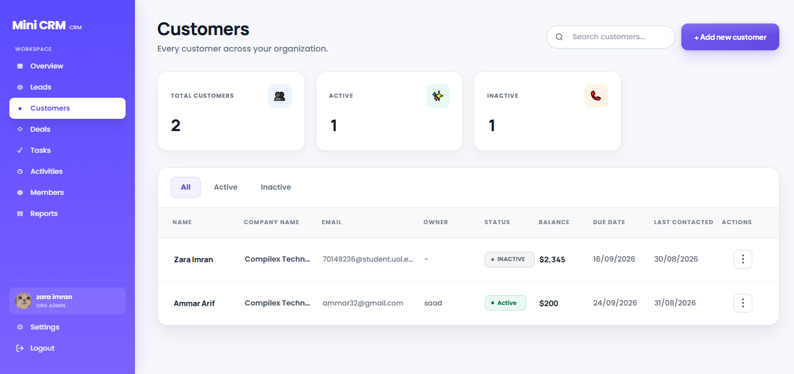 | 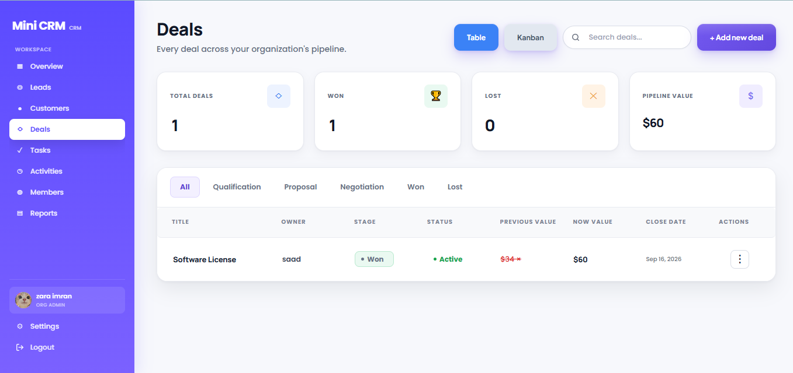 |
| **Tasks** | **Activities** |
| 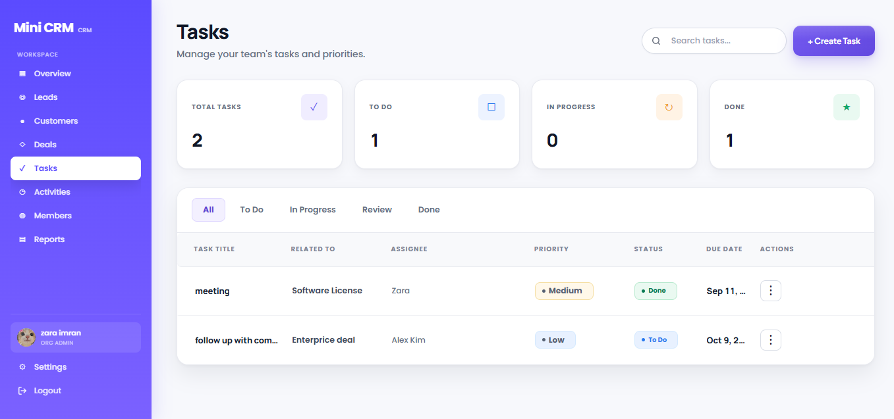 | 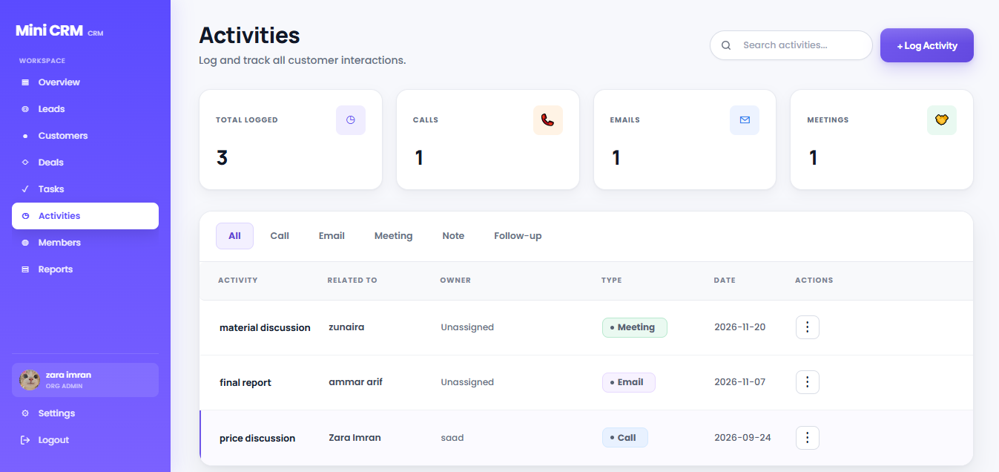 |
| **Add Lead** | **Reports** |
| 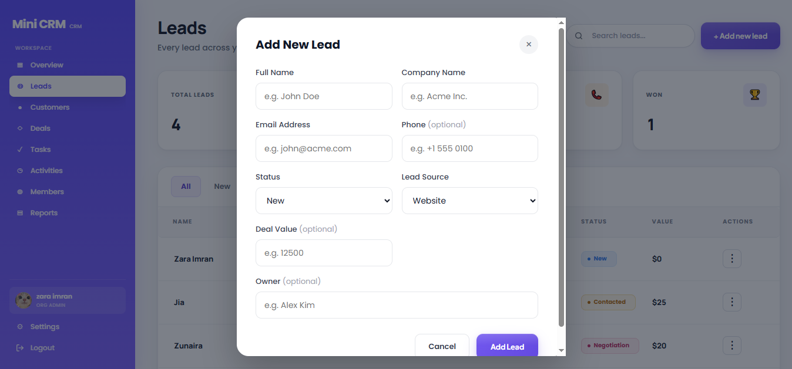 | 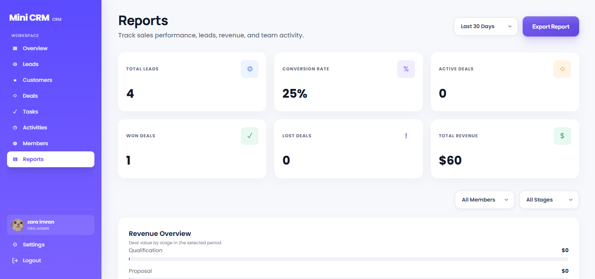 |

### Team and Settings

| Members | Invite Member |
|:---:|:---:|
| 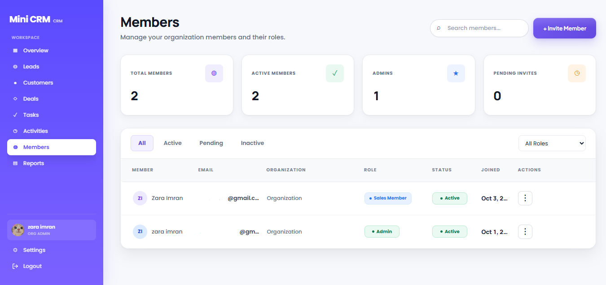 | 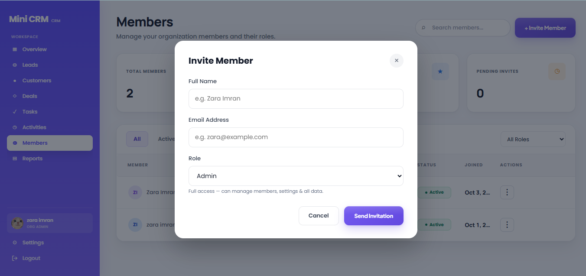 |
| **Profile Settings** | **Organization Settings** |
| 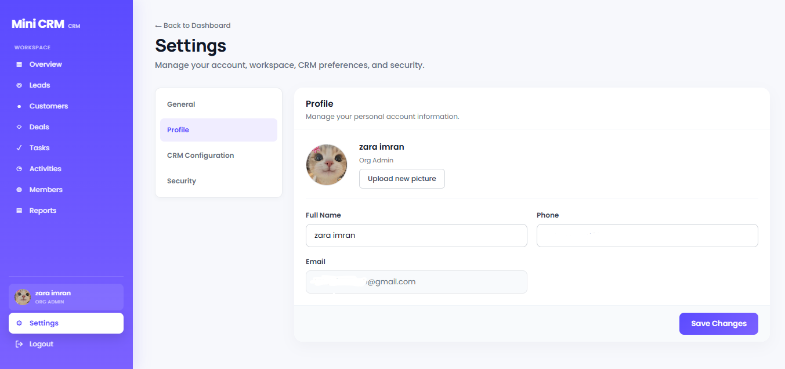 | 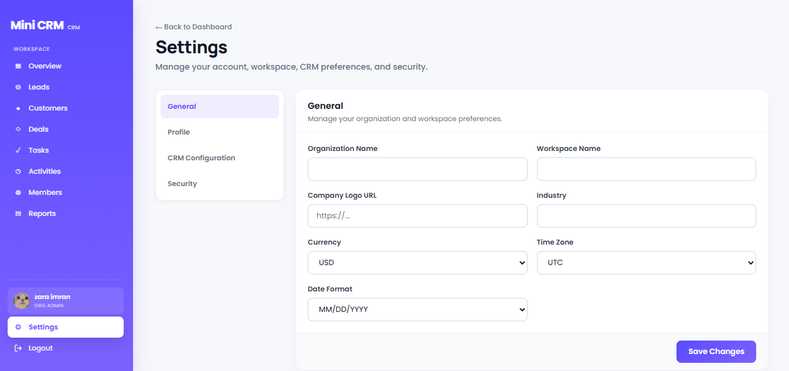 |
| **CRM Configuration** | |
| 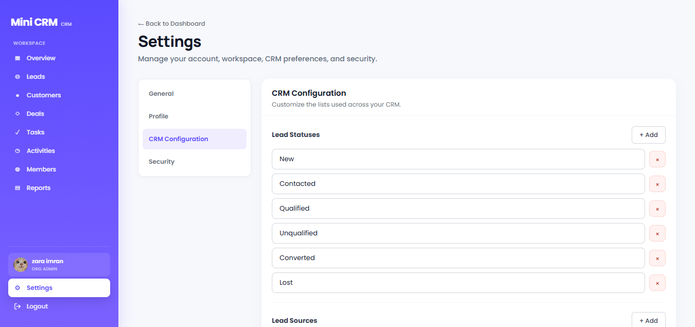 | |

### Authentication

| Login | Register |
|:---:|:---:|
| 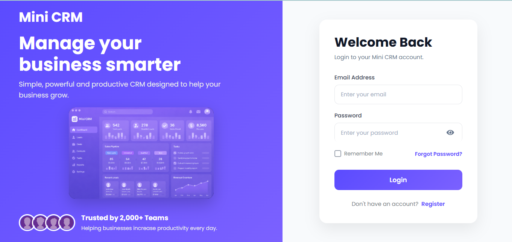 | 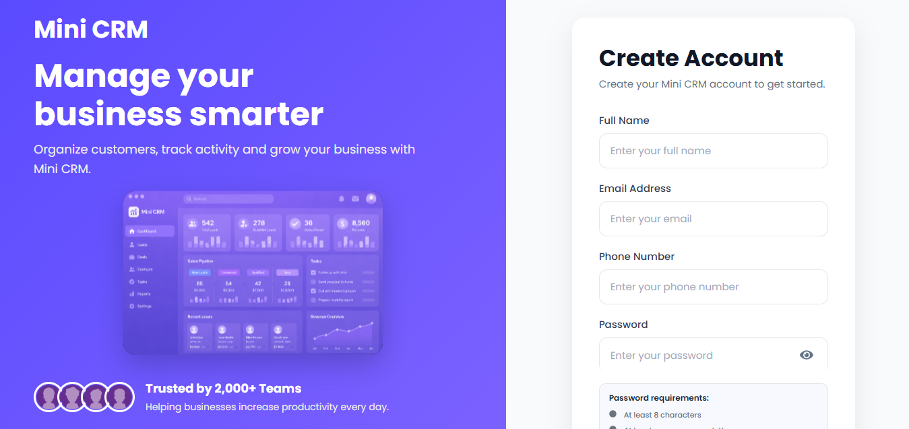 |
| **Email OTP Verification** | **Forgot Password** |
| 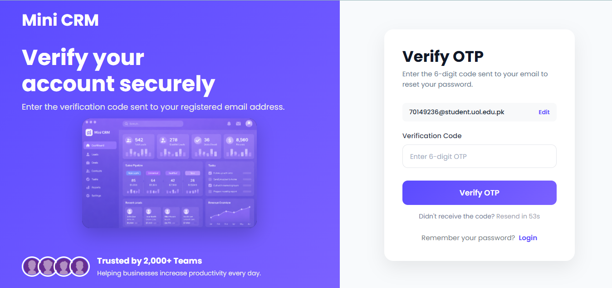 | 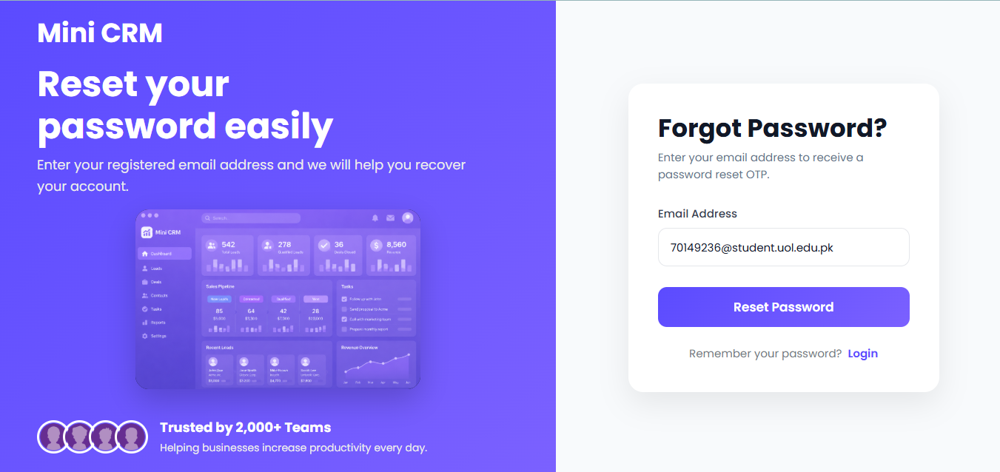 |

## Table of Contents

- [Screenshots](#screenshots)
- [Key Features](#key-features)
- [Tech Stack](#tech-stack)
- [Roles and Access](#roles-and-access)
- [Application Pages](#application-pages)
- [Project Structure](#project-structure)
- [API Reference](#api-reference)
- [Getting Started](#getting-started)
- [Environment Variables](#environment-variables)
- [Scripts](#scripts)
- [Data Models](#data-models)
- [Project Status and Roadmap](#project-status-and-roadmap)
- [Author](#author)

## Key Features

| Area | Capabilities |
|---|---|
| **Authentication** | Registration with email OTP verification, login, and OTP-based password reset |
| **Team Management** | Member invitations by email, role assignment, and invitation acceptance flow |
| **CRM Core** | Full CRUD for leads, customers, deals, tasks, and activities |
| **Customer Records** | Purchase tracking per customer; lead-to-customer conversion |
| **Reporting** | Date-range reports with member and stage filters, plus CSV export |
| **Settings** | Profile and avatar, notification preferences, organization settings, CRM option lists, password change |
| **Navigation** | Role-aware sidebar for admins, managers, sales reps, viewers, and super admins |

## Tech Stack

| Layer | Technologies |
|---|---|
| **Frontend** | React 19, React Router 7, Vite 8, custom CSS |
| **Backend** | Node.js, Express 5 |
| **Database** | MongoDB with Mongoose 9 |
| **Authentication** | JSON Web Tokens (JWT), bcrypt password hashing |
| **Validation** | Yup |
| **Email** | EmailJS (verification, recovery, invitations) |
| **Deployment** | Vercel (SPA rewrites configured in `vercel.json`) |

## Roles and Access

| Role | Purpose |
|---|---|
| `super_admin` | Platform-level administration |
| `org_admin` | Manages members and workspace settings |
| `sales_manager` | Limited member and configuration permissions |
| `sales_rep` | Day-to-day work with CRM records |
| `viewer` | Read-oriented access |

Navigation and member-management actions are role-aware. See [Project Status and Roadmap](#project-status-and-roadmap) for the scope of server-side enforcement.

## Application Pages

Dashboard, Leads, Customers, Deals, Tasks, Activities, Members, Reports, and Settings, plus public pages for login, registration, email verification, invitation acceptance, and password recovery.

## Project Structure

```text
BACKEND/
  middleware/       JWT authentication middleware
  models/           Mongoose schemas
  routes/           Express API routes
  utils/            Email and authentication utilities
  validators/       Yup validation schemas
  server.js         Express and MongoDB entry point

screenshots/        App screenshots used in this README

FRONTEND/
  src/
    api/            API client code
    components/     Shared UI components and modals
    config/         Navigation and page configuration
    hooks/          Reusable React hooks
    pages/          CRM pages
    styles/         Page and component styles
  vite.config.js
  vercel.json
```

## API Reference

Authentication routes are public. All other routes require a valid JWT bearer token.

### Authentication

| Endpoint | Description |
|---|---|
| `/auth/register` | Register an account |
| `/auth/verify-otp` | Verify registration email |
| `/auth/resend-otp` | Request a new verification code |
| `/auth/login` | Authenticate and receive a token |
| `/auth/forgot-password` | Start password recovery |
| `/auth/verify-reset-otp` | Verify recovery code |
| `/auth/reset-password` | Set a new password |
| `/auth/accept-invitation` | Accept a member invitation |

### Users and Members

| Endpoint | Description |
|---|---|
| `/users/profile` | Read or update the current profile |
| `/users/members` | List or invite organization members |
| `/users/members/:id` | Update or remove a member |

### CRM Resources

| Endpoint | Description |
|---|---|
| `/leads` | Create, list, update, and delete leads |
| `/customers` | Create, list, update, and delete customers |
| `/customers/:id/purchases` | Add a purchase to a customer |
| `/deals` | Create, list, update, and delete deals |
| `/tasks` | Create, list, update, and delete tasks |
| `/activities` | Create, list, update, and delete activities |

Resource routes use `/:id` for update and delete operations.

### Reports and Settings

| Endpoint | Description |
|---|---|
| `/reports/overview` | Report data for a selected period |
| `/settings` | Load settings |
| `/settings/organization` | Update organization preferences |
| `/settings/notifications` | Update notification preferences |
| `/settings/crm` | Update CRM option lists |
| `/settings/password` | Change password |

## Getting Started

### Prerequisites

- Node.js and npm
- A MongoDB instance (local or hosted)
- An [EmailJS](https://www.emailjs.com/) account

### Installation

**1. Clone the repository**

```bash
git clone <your-repo-url>
cd <your-repo-folder>
```

**2. Run the backend**

```bash
cd BACKEND
npm install
cp .env.example .env    # then fill in your values
npm run dev
```

**3. Run the frontend** (in a second terminal)

```bash
cd FRONTEND
npm install
cp .env.example .env    # then fill in your values
npm run dev
```

The API runs on `http://localhost:5000` by default, and the frontend is typically served at `http://localhost:5173`.

> **Note:** The backend `.env.example` sets `PORT=3000`, while the backend default and the frontend sample API URL use `5000`. Set `PORT=5000` so both sides match.

## Environment Variables

### Backend (`BACKEND/.env`)

| Variable | Description |
|---|---|
| `MONGO_URI` | MongoDB connection string |
| `PORT` | API port (default `5000`) |
| `FRONTEND_URL` | Frontend base URL used in invitation links |
| `JWT_SECRET` | Secret for signing and verifying JWTs |
| `JWT_EXPIRES_IN` | Token expiry |
| `EMAILJS_SERVICE_ID` | EmailJS service ID |
| `EMAILJS_TEMPLATE_ID` | EmailJS template ID |
| `EMAILJS_PUBLIC_KEY` | EmailJS public key |
| `EMAILJS_PRIVATE_KEY` | EmailJS private key |

### Frontend (`FRONTEND/.env`)

| Variable | Description |
|---|---|
| `VITE_API_URL` | Backend base URL, e.g. `http://localhost:5000` |
| `VITE_EMAILJS_SERVICE_ID` | EmailJS service ID |
| `VITE_EMAILJS_TEMPLATE_ID` | EmailJS template ID |
| `VITE_EMAILJS_PUBLIC_KEY` | EmailJS public key |

> Never commit secrets. Only the EmailJS **public** key belongs in frontend variables.

## Scripts

| Location | Command | Description |
|---|---|---|
| `BACKEND` | `npm run dev` | Start the API in development mode |
| `BACKEND` | `npm start` | Start the API |
| `FRONTEND` | `npm run dev` | Start the Vite dev server |
| `FRONTEND` | `npm run build` | Create a production build |
| `FRONTEND` | `npm run preview` | Preview the production build |
| `FRONTEND` | `npm run lint` | Run ESLint |

## Data Models

Mongoose models cover **users, organizations, leads, customers, deals, activities, and tasks**, all with timestamps.

- Deals can link to customers.
- Converted leads can link to generated customers.
- Customers contain embedded purchase records.

## Project Status and Roadmap

This is an actively developed portfolio project. The items below are known areas for improvement and are planned work, not completed features.

- [ ] **Multi-tenant data isolation:** add `organizationId` to CRM schemas and scope all CRUD and report queries by organization. Until then, this project should not be used to host data from multiple organizations.
- [ ] **Server-side role enforcement:** extend role checks beyond navigation and member management to all CRM operations.
- [ ] **Live dashboard metrics:** replace sample KPI and table values in `dashboardConfig.js` with database-backed data.
- [ ] **Automated testing:** add unit and API integration tests (only a lint script exists today).
- [ ] **Account deletion:** currently unavailable.

## Author

**Zara Imran**

[](https://github.com/zaraimran03)
[](https://zaraxtech.vercel.app)
